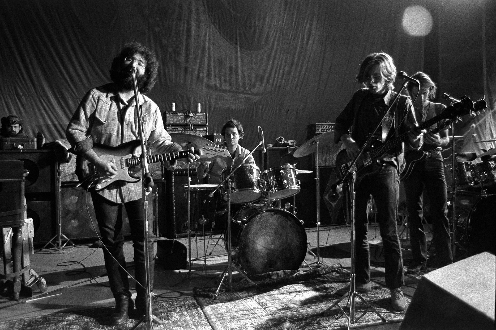

   
```{r setup}
library(tidyverse)
library(knitr)
library(plotly)
library(spotifyr)
library(compmus)
library(rstanarm)
library(tidymodels)
library(protoclust)
library(ggdendro)
library(heatmaply)
library(randomForest)
source('spotify.R')

CCS1 <- get_playlist_audio_features('113196588','56LRNwZLB1m5ozn7XiRwc0')
CCS2 <- get_playlist_audio_features('113196588','0fLVeqfD79Bw8n6aNuPRVK')
CCS3 <- get_playlist_audio_features('113196588','5iBikvsn2LOu8eJNpEDVlH')
CCS4 <- get_playlist_audio_features('113196588','32K2c8tmRSjSQKVljnM5zZ')
CCS5 <- get_playlist_audio_features('113196588','5zjh9EUejGp4NMfXsxeDUJ')
CCS6 <- get_playlist_audio_features('113196588','5pOE9W2ks6ivKlQpXrZsU5')
CCS7 <- get_playlist_audio_features('113196588','0W5ZvCOKCOcAJztZG0toxC')

MMU1 <- get_playlist_audio_features('113196588','7AOzpn4v6rai73JRFilCg4')
MMU2 <- get_playlist_audio_features('113196588','7lzIhjAVmzKF2M9NC2Dbd0')
MMU3 <- get_playlist_audio_features('113196588','2NzmIqg2fS5LfBa5BaWIOu')
MMU4 <- get_playlist_audio_features('113196588','3WErsKgOHyBQyiQ2Vbna2j')
MMU5 <- get_playlist_audio_features('113196588','1de3oCr2ZJIhsmB4FXR7KT')
MMU1972 <- get_playlist_audio_features('113196588','59IZERcuJxLsAQngTvm1ET')

NFA1 <- get_playlist_audio_features('113196588','4beoU2UmxVRWs8KPE34qX2')
NFA2 <- get_playlist_audio_features('113196588','79NvADGsHANesMs0fy720U')
NFA3 <- get_playlist_audio_features('113196588','2bsl6T9bkBxGe1wc6xaWGy')
NFA4 <- get_playlist_audio_features('113196588','20sfHVXxOb8LBaIz6gUd1N')
NFA5 <- get_playlist_audio_features('113196588','6ptJcBQ4mMZfuWmPr9ymBC')
NFA6 <- get_playlist_audio_features('113196588','4ziXy2RGeerGdt6M2eikq1')

DS1 <- get_playlist_audio_features('113196588','49pPjzAbeKLyMtzq9f76zL')
DS2 <- get_playlist_audio_features('113196588','2PTsiwUQxXbeOO0e42mJa7')
DS3 <- get_playlist_audio_features('113196588','6VHNqQTvAz8ojOwlDkWGKC')
DS4 <- get_playlist_audio_features('113196588','3XHn9z5J4ukaIfR7iXS1wi')
DS5 <- get_playlist_audio_features('113196588','3ue2jCxvTCsyb6mJo5JVXa')
DS6 <- get_playlist_audio_features('113196588','1l0e1rUdOlxTjrfrl6CR2x')

    Chinacat <- CCS1 %>% mutate(playlist = "1967-1968") %>% bind_rows(CCS2 %>% mutate(playlist = "1969-1970")) %>% bind_rows(CCS3 %>% mutate(playlist = "1971-1972")) %>% bind_rows(CCS4 %>% mutate(playlist = "1973-1976")) %>% bind_rows(CCS5 %>% mutate(playlist = "1977-1981")) %>% bind_rows(CCS6 %>% mutate(playlist = "1982-1988")) %>% bind_rows(CCS7 %>% mutate(playlist = "1990-1995"))
    
    Meuncle <- MMU1 %>% mutate(playlist = "1969-1970") %>% bind_rows(MMU2 %>% mutate(playlist = "1971-1972")) %>% bind_rows(MMU3 %>% mutate(playlist = "1973-1976")) %>% bind_rows(MMU4 %>% mutate(playlist = "1977-1981")) %>% bind_rows(MMU5 %>% mutate(playlist = "1982-1988"))
    
    Notfade <- NFA1 %>% mutate(playlist = "1969-1970") %>% bind_rows(NFA2 %>% mutate(playlist = "1971-1972")) %>% bind_rows(NFA3 %>% mutate(playlist = "1973-1976")) %>% bind_rows(NFA4 %>% mutate(playlist = "1977-1981")) %>% bind_rows(NFA5 %>% mutate(playlist = "1982-1988")) %>% bind_rows(NFA6 %>% mutate(playlist = "1989-1989"))
    
    Darkstar <- DS1 %>% mutate(playlist = "1967-1968") %>% bind_rows(DS2 %>% mutate(playlist = "1969-1970")) %>% bind_rows(DS3 %>% mutate(playlist = "1971-1972")) %>% bind_rows(DS4 %>% mutate(playlist = "1973-1976")) %>% bind_rows(DS5 %>% mutate(playlist = "1977-1981")) %>% bind_rows(DS6 %>% mutate(playlist = "1989-1995"))
    
circshift <- function(v, n) {if (n == 0) v else c(tail(v, n), head(v, -n))}
                                    
    # C     C#    D     Eb    E     F     F#    G     Ab    A     Bb    B 
major_chord <- 
    c(1,    0,    0,    0,    1,    0,    0,    1,    0,    0,    0,    0)
minor_chord <- 
    c(1,    0,    0,    1,    0,    0,    0,    1,    0,    0,    0,    0)
seventh_chord <- 
    c(1,    0,    0,    0,    1,    0,    0,    1,    0,    0,    1,    0)

major_key <- 
    c(6.35, 2.23, 3.48, 2.33, 4.38, 4.09, 2.52, 5.19, 2.39, 3.66, 2.29, 2.88)
minor_key <-
    c(6.33, 2.68, 3.52, 5.38, 2.60, 3.53, 2.54, 4.75, 3.98, 2.69, 3.34, 3.17)

    
key_templates <-
    tribble(
        ~name    , ~template,
        'Gb:maj', circshift(major_key,  6),
        'Bb:min', circshift(minor_key, 10),
        'Db:maj', circshift(major_key,  1),
        'F:min' , circshift(minor_key,  5),
        'Ab:maj', circshift(major_key,  8),
        'C:min' , circshift(minor_key,  0),
        'Eb:maj', circshift(major_key,  3),
        'G:min' , circshift(minor_key,  7),
        'Bb:maj', circshift(major_key, 10),
        'D:min' , circshift(minor_key,  2),
        'F:maj' , circshift(major_key,  5),
        'A:min' , circshift(minor_key,  9),
        'C:maj' , circshift(major_key,  0),
        'E:min' , circshift(minor_key,  4),
        'G:maj' , circshift(major_key,  7),
        'B:min' , circshift(minor_key, 11),
        'D:maj' , circshift(major_key,  2),
        'F#:min', circshift(minor_key,  6),
        'A:maj' , circshift(major_key,  9),
        'C#:min', circshift(minor_key,  1),
        'E:maj' , circshift(major_key,  4),
        'G#:min', circshift(minor_key,  8),
        'B:maj' , circshift(major_key, 11),
        'D#:min', circshift(minor_key,  3))

```

Analysing the Live {.storyboard}
=========================================

### Introduction: A Long, Strange Trip

```{r}



```

***

The Grateful Dead was an groundbreaking American jam band established in 1965 that fused many genres of music such as folk, jazz, blues, psychedelic rock, and gospel. They were especially known for their live performances with lengthy instrumental jams, which would usually be elaborations on some basis songs - for example, [they performed China Cat Sunflower over 500 different times](http://deadessays.blogspot.com/2011/07/grateful-dead-song-graph.html).

Performing music live continues to be an important part of popular music - especially in the case of jam bands, where studio recordings of music are often secondary in importance in relation to live recordings and concerts. The emphasis of the "live" raises many musicological questions that can also be investigated through data extraction - such as, can we track musical developments and creative strategies within a group by looking at their live performances over time? The Grateful Dead is an optimal case for such a study, as the "taping culture" among their fans have made plenty of recordings available online, including Spotify, where, for example, over 80 different recordings of Dark Star alone exist.

To support my corpus, I will look at several songs that have been heavily played by the Grateful Dead throughout their career, in this way comparing and contrasting my findings. Another reason for picking various songs is also simply because they would not use some tracks at all in some periods - Dark Star was never played at all between 1974 and 1978. The main songs I will use will be Dark Star, Not Fade Away, China Cat Sunflower, and Me And My Uncle, all songs the Grateful Dead have played around 400-600 times each in their career.

[Image Source](https://time.com/3847162/grateful-dead-50/)

### The Live as a Factor

When investigating the different live performances of the Grateful Dead, it's important to keep in mind that the tracks are not directly mediated performances, but recordings taken in different circumstances and with different equipment - varying from professional recordings taken for commercial release, to fan recordings. As the recording circumstances (most assumedly!) have no impact on the musical developments undertaken by the Grateful Dead, it is important to keep in mind what data features that Spotify uses may be impacted by the recording process. From the [features listed by Spotify](https://developer.spotify.com/documentation/web-api/reference/tracks/get-several-audio-features/), it appears that energy, liveness, and loudness may be impacted, as they are features that are determined by the dynamics of the music.

To investigate what features may be impacted by the recording process, I have created a playlist of Me And My Uncle recordings recorded in the year 1972. I have chosen their most standard and least improvisorial song and limited the recording period, thereby having a selection of songs with what I assume features little musical development and deviation. I will look at what factors deviate the most, and compare them to the deviations present within the rest of the recordings.

It appears that the least deviating features are speechiness, (obvious, as all recordings feature near-identical singing parts from the original song) danceability, energy, and valence. On the other hand, the high deviations of instrumentalness within the same period problematises the use of it as a clear indicator of musical development, while liveness, of which deviation is virtually identical to that of all recordings of the song, is perhaps the least useful indicator of all, as it is meant to indicate whether the music was played live, which we already know is the case. Acousticness, which features the greatest difference between both deviations, would be an interesting feature to look at, along with those with the smallest deviations - but we must take the numbers with a grain of salt, as many other factors might play into differences in performance, such as the setup used by the band, or the way the song was lead up into in the performance.

***

| Feature          | Me And My Uncle (recorded 1972) | Me And My Uncle (all) |
|------------------|:-------------------------------:|:---------------------:|
| Acousticness     |                           0.104 |                 0.181 |
| Danceability     |                           0.033 |                 0.041 |
| Energy           |                           0.076 |                 0.103 |
| Liveness         |                           0.257 |                 0.258 |
| Instrumentalness |                           0.203 |                 0.288 |
| Speechiness      |                           0.014 |                 0.018 |
| Valence          |                           0.077 |                 0.103 |
| Loudness         |                            1.56 |                  2.32 |


### Initial Findings

```{r}
    
    ggplot(Chinacat, aes(x=playlist, y=valence)) + geom_boxplot(alpha=0.7) + stat_summary(fun.y=mean, geom="point", size=4, color="red", fill="red") + geom_line() + theme(legend.position="none") + scale_fill_brewer(palette="Set1") + theme_light() + labs(x = "Period", y = "Valence") + ggtitle("Plot of China Cat Sunflower Performances Over Time by Valence")

ggplot(Meuncle, aes(x=playlist, y=valence)) + geom_boxplot(alpha=0.7) + stat_summary(fun.y=mean, geom="point", size=4, color="red", fill="red") + geom_line() + theme(legend.position="none") + scale_fill_brewer(palette="Set1") + theme_light() + labs(x = "Period", y = "Valence") + ggtitle("Plot of Me And My Uncle Performances Over Time by Valence")    

ggplot(Notfade, aes(x=playlist, y=valence)) + geom_boxplot(alpha=0.7) + stat_summary(fun.y=mean, geom="point", size=4, color="red", fill="red") + geom_line() + theme(legend.position="none") + scale_fill_brewer(palette="Set1") + theme_light() + labs(x = "Period", y = "Valence") + ggtitle("Plot of Not Fade Away Performances Over Time by Valence")    

ggplot(Darkstar, aes(x=playlist, y=valence)) + geom_boxplot(alpha=0.7) + stat_summary(fun.y=mean, geom="point", size=4, color="red", fill="red") + geom_line() + theme(legend.position="none") + scale_fill_brewer(palette="Set1") + theme_light() + labs(x = "Period", y = "Valence") + ggtitle("Plot of Dark Star Performances Over Time by Valence")

ggplot(Darkstar, aes(x=playlist, y=track.duration_ms)) + geom_boxplot(alpha=0.7) + stat_summary(fun.y=mean, geom="point", size=4, color="red", fill="red") + geom_line() + theme(legend.position="none") + scale_fill_brewer(palette="Set1") + theme_light() + labs(x = "Period", y = "Track Duration (ms)") + ggtitle("Plot of Dark Star Performances Over Time by Track Duration")

```

***

I begin my preliminary questions by asking - can we even *see* differences of performances over time? I would argue yes, as, for example, overall valence has clearly gone down for both China Cat Sunflower, Me and My Uncle, and Not Fade Away, with valence generally peaking in the first half of the 1970s. 

An interesting odd-one-out is Dark Star. Dark Star was performed since the foundation of the Grateful Dead, but the song was initially released as an upbeat single, which is reflected in the higher valence in their early years. It was the highly-acclaimed Live/Dead live album, recorded in 1969, that signalled the song's evolution into the a cornerstone of the band's jamming. Another variable that can help us see how the song became the tune of choice for jamming on is the track duration - the last chart shows how the length of the Dark Star tracks is inversely correlated with the valence, showing how the song evolved from being upbeat to drawn-out, before slightly reversing the trend back to upbeatness in their later years.

The Live Sound & Structure {.storyboard}
=========================================

### Chroma Cat Sunflower I

```{r}
    
ggplot(Chinacat, aes(playlist)) + geom_bar(aes(fill = key_mode)) + theme_light() + labs(x = "Period", y = "Count", fill = "Key Mode") + ggtitle("Plot of Key Modes of China Cat Sunflower over Time")


```

***

As the live recordings of the Grateful Dead are displayed, accessed, and played in the same way as any other studio album on streaming services, it may tempting to see these songs in concerts as having the same innate property - must a China Cat Sunflower performance, for instance, always have the same key or structure in order to be a real China Cat Sunflower performance? This idea, however, overlooks the fluidity of the Grateful Dead's songs, as they had been performed for different crowds, by different musicians, with a different repetoire alongside different songs and improvisations.

The first graph shows how the song keys of China Cat Sunflower, although frequently G major, has never fully conformed to the key mode in the early and late periods - at least, according to Spotify. [This is reflected by the role the song has played in live performances over time](https://www.dead.net/features/greatest-stories-ever-told/greatest-stories-ever-told-china-cat-sunflower), from being an extended jam between different songs in the first year of its introduction, to always being paired with "I Know You Rider" after 1969.


### Chroma Cat Sunflower II

```{r}
    
Chromacat68 <- get_tidy_audio_analysis('3QjwQBoyJzhtc329igMINs') %>% compmus_align(sections, segments) %>% select(sections) %>% unnest(sections) %>% mutate(pitches = map(segments, compmus_summarise, pitches, method = 'mean', norm = 'manhattan'))

Chromacat72 <- get_tidy_audio_analysis('3K80eTMvPE8oG1aWXi4gDA') %>% compmus_align(sections, segments) %>% select(sections) %>% unnest(sections) %>% mutate(pitches = map(segments, compmus_summarise, pitches, method = 'mean', norm = 'manhattan'))

Chromacat80 <- get_tidy_audio_analysis('0sMrdyY2ya6D8PeRyxclpB') %>% compmus_align(sections, segments) %>% select(sections) %>% unnest(sections) %>% mutate(pitches = map(segments, compmus_summarise, pitches, method = 'mean', norm = 'manhattan'))

Chromacat68 %>% compmus_match_pitch_template(key_templates, 'euclidean', 'manhattan') %>% ggplot(aes(x = start + duration / 2, width = duration, y = name, fill = d)) +geom_tile() + scale_fill_viridis_c(option = 'E', guide = 'none') + theme_minimal() + labs(x = 'Time (s)', y = '') + ggtitle("Keygram of China Cat Sunflower, San Francisco 1968")

Chromacat72 %>% compmus_match_pitch_template(key_templates, 'euclidean', 'manhattan') %>% ggplot(aes(x = start + duration / 2, width = duration, y = name, fill = d)) +geom_tile() + scale_fill_viridis_c(option = 'E', guide = 'none') + theme_minimal() + labs(x = 'Time (s)', y = '') + ggtitle("Keygram of China Cat Sunflower, Paris 1972")

Chromacat80 %>% compmus_match_pitch_template(key_templates, 'euclidean', 'manhattan') %>% ggplot(aes(x = start + duration / 2, width = duration, y = name, fill = d)) +geom_tile() + scale_fill_viridis_c(option = 'E', guide = 'none') + theme_minimal() + labs(x = 'Time (s)', y = '') + ggtitle("Keygram of China Cat Sunflower, University Park 1980")

```

***

What does Spotify's chroma features indicate, if anything, about how the Grateful Dead varied in their keys in China Cat Sunflower? I have chosen to create a keygram of three different performances, in order to compare and contrast them. I have chosen a performance from San Francisco in 1968, which Spotify recognises as B minor, a performance in Paris in 1972 during the period where the song is apparently "established" as being in G major, and a performance from 1980 in University Park, which Spotify also recognises as B minor. I have used 1–0 coding for the chord templates with Krumhansl–Kessler key profiles, representing the songs with Spotify's estimated bars.

The resulting keygrams are very fuzzy - not surprising, given the improvisational performance with different instruments playing across different tangents. However, Spotify does manage to detect the modulation points, such as around the 90-second mark of the first track, or the 120-second mark on the second track. The third, late-era track has less defined modulations, with the recording being dominated by guitar improvisation.

### Not Fade Away 

```{r}
Notfade1 <- get_playlist_audio_features('113196588','4beoU2UmxVRWs8KPE34qX2') %>% add_audio_analysis()
Notfade2 <- get_playlist_audio_features('113196588','79NvADGsHANesMs0fy720U') %>% add_audio_analysis()
Notfade3 <- get_playlist_audio_features('113196588','2bsl6T9bkBxGe1wc6xaWGy') %>% add_audio_analysis()
Notfade4 <- get_playlist_audio_features('113196588','20sfHVXxOb8LBaIz6gUd1N') %>% add_audio_analysis()
Notfade5 <- get_playlist_audio_features('113196588','6ptJcBQ4mMZfuWmPr9ymBC') %>% add_audio_analysis()
Notfade6 <- get_playlist_audio_features('113196588','4ziXy2RGeerGdt6M2eikq1') %>% add_audio_analysis()

Notfadecompare <- Notfade1 %>% mutate(period = "1969-1970") %>% bind_rows(Notfade2 %>% mutate(period = "1971-1972")) %>% bind_rows(Notfade3 %>% mutate(period = "1973-1976")) %>% bind_rows(Notfade4 %>% mutate(period = "1977-1981")) %>% bind_rows(Notfade5 %>% mutate(period = "1982-1988")) %>% bind_rows(Notfade6 %>% mutate(period = "1989-1995"))

Notfadecompare %>% mutate(sections = map(sections, summarise_at, vars(tempo, loudness, duration), list(section_mean = mean, section_sd = sd))) %>% unnest(sections) %>% ggplot(aes(x = tempo, y = tempo_section_sd, colour = period, alpha = loudness)) +geom_point(aes(size = duration / 60)) + geom_rug() + theme_minimal() + ylim(0, 5) + labs(x = 'Mean Tempo (bpm)', y = 'SD Tempo', colour = 'Period', size = 'Duration (min)', alpha = 'Volume (dBFS)') + ggtitle("Plot of Not Fade Away Variations in Tempo") 

NotfadeNY <- get_tidy_audio_analysis('5tw0XOtzp0dZlLvESyiYAl')

#NotfadeNY %>% tempogram(window_size = 8, hop_size = 1, cyclic = FALSE) %>% ggplot(aes(x = time, y = bpm, fill = power)) + geom_raster() + scale_fill_viridis_c(guide = 'none') + labs(x = 'Time (s)', y = 'Tempo (BPM)') + theme_classic() + ggtitle("Tempogram of Not Fade Away, New York 1977") 

include_graphics("ZkdAQQQQAABBBBAAAEEEEAAAQQQCF2AAFDoxEyAAAIIIIAAAggggAACCCCAAAIIJFfgf3+8SwRx7ZqbAAAAAElFTkSuQmCC.jpg")

```

***

Not Fade Away was one of the most performed songs of the Grateful Dead. A cover of a Buddy Holly rock'n'roll song, its simple bluesy structure and lyrics made it a favourite for elaboration for the Grateful Dead. How have performances varied throughout their career, based on their tempo?

As the plot shows, the tempo has been relatively consistent for most eras, besides from 1977-1981, when it deviates wildly - while by far the most of the other renditions are slightly under the 100 BPM mark, virtually all of the recordings between 77-81 are much faster, usually over 150 BPM. Why?

A first clue is the fact that most of the 77-81 performances are much longer than average, many clocking in at around 20 minutes, as seen by the larger circle sizes. A tempogram of one of the performances, taken in 1977, reveals the fact that a single BPM number is quite decieving - the song descends from a steady blues rhythm (albeit with a highly embellished drum fill) into a faster rhythm as instruments cascade into improvisation.

[This mirrors the role Not Fade Away played in the Grateful Dead's performances over time.](http://deadessays.blogspot.com/2017/03/not-fade-away-guest-post.html) It began as a song for wide-ranging jams, before the band was reduced to a quartet and the song became tighter, seen in the smallest circles in the 71-72 era. The song gradually picked up pace before culminating in 77-78, as it returned to being a jam classic, before becoming a sing-a-long for the audience in the 80's-90's.

Meanwhile, the differences in loudness in negligible, further reflecting on its insignificance in signalling meaningful differences in the Grateful Dead's musical performances.

### Dark Star and Timbre

```{r}
    
DSStudio <- get_tidy_audio_analysis('2AF1drAUmMi8ZX0U97UJLw') %>% compmus_align(bars, segments) %>% select(bars) %>% unnest(bars) %>% mutate(pitches = map(segments, compmus_summarise, pitches, method = 'rms', norm = 'euclidean')) %>% mutate(timbre = map(segments, compmus_summarise, timbre, method = 'rms', norm = 'euclidean'))

DSStudio %>% compmus_self_similarity(timbre, 'cosine') %>% ggplot(aes(x = xstart + xduration / 2, width = xduration, y = ystart + yduration / 2,height = yduration, fill = d)) + geom_tile() + coord_fixed() + scale_fill_viridis_c(option = 'E', guide = 'none') + theme_classic() + labs(x = 'Time (s)', y = 'Time (s)') + ggtitle("Dark Star, Studio Version, April 1968")

DS68 <- get_tidy_audio_analysis('5GMd68DOhEEz6aMwSrrotf') %>% compmus_align(bars, segments) %>% select(bars) %>% unnest(bars) %>% mutate(pitches = map(segments, compmus_summarise, pitches, method = 'rms', norm = 'euclidean')) %>% mutate(timbre = map(segments, compmus_summarise, timbre, method = 'rms', norm = 'euclidean'))

DS68 %>% compmus_self_similarity(timbre, 'cosine') %>% ggplot(aes(x = xstart + xduration / 2, width = xduration, y = ystart + yduration / 2,height = yduration, fill = d)) + geom_tile() + coord_fixed() + scale_fill_viridis_c(option = 'E', guide = 'none') + theme_classic() + labs(x = 'Time (s)', y = 'Time (s)') + ggtitle("Dark Star, San Francisco, February 1968")

DSLD <- get_tidy_audio_analysis('07CwWCJetytT1cSnQOgRMU') %>% compmus_align(bars, segments) %>% select(bars) %>% unnest(bars) %>% mutate(pitches = map(segments, compmus_summarise, pitches, method = 'rms', norm = 'euclidean')) %>% mutate(timbre = map(segments, compmus_summarise, timbre, method = 'rms', norm = 'euclidean'))

DSLD %>% compmus_self_similarity(timbre, 'cosine') %>% ggplot(aes(x = xstart + xduration / 2, width = xduration, y = ystart + yduration / 2,height = yduration, fill = d)) + geom_tile() + coord_fixed() + scale_fill_viridis_c(option = 'E', guide = 'none') + theme_classic() + labs(x = 'Time (s)', y = 'Time (s)') + ggtitle("Dark Star, Live/Dead Version, February 1969")

DS73 <- get_tidy_audio_analysis('0ln0LU06lj1Ey3nEczHmo3') %>% compmus_align(bars, segments) %>% select(bars) %>% unnest(bars) %>% mutate(pitches = map(segments, compmus_summarise, pitches, method = 'rms', norm = 'euclidean')) %>% mutate(timbre = map(segments, compmus_summarise, timbre, method = 'rms', norm = 'euclidean'))

DS73 %>% compmus_self_similarity(timbre, 'cosine') %>% ggplot(aes(x = xstart + xduration / 2, width = xduration, y = ystart + yduration / 2,height = yduration, fill = d)) + geom_tile() + coord_fixed() + scale_fill_viridis_c(option = 'E', guide = 'none') + theme_classic() + labs(x = 'Time (s)', y = 'Time (s)') + ggtitle("Dark Star, Winterland, November 1973")

DS89 <- get_tidy_audio_analysis('2cvGKGSVYxSBt2BBJXJShE') %>% compmus_align(bars, segments) %>% select(bars) %>% unnest(bars) %>% mutate(pitches = map(segments, compmus_summarise, pitches, method = 'rms', norm = 'euclidean')) %>% mutate(timbre = map(segments, compmus_summarise, timbre, method = 'rms', norm = 'euclidean'))

DS89 %>% compmus_self_similarity(timbre, 'cosine') %>% ggplot(aes(x = xstart + xduration / 2, width = xduration, y = ystart + yduration / 2,height = yduration, fill = d)) + geom_tile() + coord_fixed() + scale_fill_viridis_c(option = 'E', guide = 'none') + theme_classic() + labs(x = 'Time (s)', y = 'Time (s)') + ggtitle("Dark Star, Hampton, October 1989")


```

***

So far, we have used keygrams and tempograms to peek at the structure of certain performances. Can we use changes in timbre as a way of measuring Dark Star's structural evolution?

The earliest recordings of Dark Star reveal that it follows a similar structure to the single studio version. The 1968 version begins slowly, before opening into the stanza, after which some musical improvisation plays out, returning to a new stanza before mellowing out.

In comparison, the longer improvisations of Dark Star, beginning with Live/Dead, are a lot more structureless. Some details can be gleaned. One can recognise quiet and mellow improvisation that precedes the recognisable introduction of the song, and the more restrained improvisation around the 13-15 minute mark, in the Live/Dead version. In the 1973 performance, the still moments where quiet guitar sounds glide listlessly around muted cymbals can also be recognised, around the 19-23 minute mark. The 1989 performance reveals choppy changes in timbre from the 13-minute mark, signalling the song's use as a vehicle for far more experimental and haphazard improvisation than ever before.

By looking at these matrices that uncover the texture of the performances, we can uncover the structures of the improvisations, indicating how Dark Star has vastly changed in structure over their career.

A Story of the Dead {.storyboard}
=========================================

### 1977 - The "Greatest" Year? I

```{r}
    
NFA77 <- get_playlist_audio_features('113196588','3PxrouixNlUwjDFRkk5Pwr') %>% slice(1:20) %>% add_audio_analysis

NFA7579 <- get_playlist_audio_features('113196588','6khHDlMgxAlejvTMDtlUY5') %>% slice(1:20) %>% add_audio_analysis
 
NFA <- NFA77 %>% mutate(playlist = "Not Fade Away 1977") %>% bind_rows(NFA7579 %>% mutate(playlist = "Not Fade Away 1975-1979")) %>% mutate(playlist = factor(playlist)) %>% mutate(segments = map2(segments, key, compmus_c_transpose)) %>% mutate(pitches = map(segments, compmus_summarise, pitches, method = 'mean', norm = 'manhattan'), timbre = map(segments, compmus_summarise, timbre, method = 'mean')) %>% mutate(pitches = map(pitches, compmus_normalise, 'clr')) %>% mutate_at(vars(pitches, timbre), map, bind_rows) %>% unnest(cols = c(pitches, timbre))

NFA_class <- recipe(playlist ~ danceability + energy + loudness + speechiness + acousticness + instrumentalness + liveness + valence + tempo + duration + C + `C#|Db` + D + `D#|Eb` + E + `F` + `F#|Gb` + G + `G#|Ab` + A + `A#|Bb` + B + c01 + c02 + c03 + c04 + c05 + c06 + c07 + c08 + c09 + c10 + c11 + c12, data = NFA) %>%step_center(all_predictors()) %>% step_scale(all_predictors()) %>% prep(NFA) %>% juice

NFA_cv <- NFA_class %>% vfold_cv(10)

NFA_forest <- rand_forest(mode = 'classification') %>% set_engine('randomForest')

predict_forest <- function(split)
     fit(NFA_forest, playlist ~ ., data = analysis(split)) %>% 
     predict(assessment(split), type = 'class') %>%
     bind_cols(assessment(split))

NFA_cv %>% mutate(pred = map(splits, predict_forest)) %>% unnest(pred) %>% metric_set(accuracy, kap, j_index)(truth = playlist, estimate = .pred_class)

NFA_class %>% fit(NFA_forest, playlist ~ ., data = .) %>% pluck('fit') %>% randomForest::varImpPlot()


SS77 <- get_playlist_audio_features('113196588','3f2AAtz64DoC1qHpEb2MUp') %>% slice(1:20) %>% add_audio_analysis

SS7579 <- get_playlist_audio_features('113196588','44KTd4CZzUQgd3gm3sgsjb') %>% slice(1:20) %>% add_audio_analysis
 
SS <- SS77 %>% mutate(playlist = "St. Stephen 1977") %>% bind_rows(SS7579 %>% mutate(playlist = "St. Stephen 1975-1979")) %>% mutate(playlist = factor(playlist)) %>% mutate(segments = map2(segments, key, compmus_c_transpose)) %>% mutate(pitches = map(segments, compmus_summarise, pitches, method = 'mean', norm = 'manhattan'), timbre = map(segments, compmus_summarise, timbre, method = 'mean')) %>% mutate(pitches = map(pitches, compmus_normalise, 'clr')) %>% mutate_at(vars(pitches, timbre), map, bind_rows) %>% unnest(cols = c(pitches, timbre))

SS_class <- recipe(playlist ~ danceability + energy + loudness + speechiness + acousticness + instrumentalness + liveness + valence + tempo + duration + C + `C#|Db` + D + `D#|Eb` + E + `F` + `F#|Gb` + G + `G#|Ab` + A + `A#|Bb` + B + c01 + c02 + c03 + c04 + c05 + c06 + c07 + c08 + c09 + c10 + c11 + c12, data = NFA) %>%step_center(all_predictors()) %>% step_scale(all_predictors()) %>% prep(NFA) %>% juice

SS_cv <- NFA_class %>% vfold_cv(10)

SS_forest <- rand_forest(mode = 'classification') %>% set_engine('randomForest')

predict_forest <- function(split)
     fit(NFA_forest, playlist ~ ., data = analysis(split)) %>% 
     predict(assessment(split), type = 'class') %>%
     bind_cols(assessment(split))

SS_cv %>% mutate(pred = map(splits, predict_forest)) %>% unnest(pred) %>% metric_set(accuracy, kap, j_index)(truth = playlist, estimate = .pred_class)

SS_class %>% fit(SS_forest, playlist ~ ., data = .) %>% pluck('fit') %>% randomForest::varImpPlot()

```

***

1977 is considered by many Deadheads to feature [the finest performances by the band](https://www.rollingstone.com/music/music-news/the-grateful-deads-greatest-year-243585/) - including the Cornell Show, [a concert considered so legendary an entire book was written about it](https://liveforlivemusic.com/features/5-8-77-cornell-grateful-dead-greatest/). What makes this year stand out in particular - are there any features of their music in this year that are distinct from the rest? Are these distinct features the same for all songs in my corpus? To investigate, I have made two playlists for classification - one compiling their 1977 performances, and the other compiling their other performances between 1975-1979.

The two songs I have used is Not Fade Away, and another Grateful Dead mainstay, St. Stephen - Spotify has almost no recordings of Me and My Uncle, Dark Star, or China Cat Sunflower during this period. By employing random forests and running the code a couple of times, I have concluded that acousticness and instrumentalness, along with Timbre Component 1 and Timbre Component 9, are the four defining features of the 1977 performances.

### 1977 - The Greatest Year? II

```{r}
    
NFA %>% ggplot(aes(x = c01, y = c09, colour = playlist, size = acousticness)) + geom_point(alpha = 0.8) + scale_color_brewer(type = 'qual', palette = 'Accent') + labs(x = 'Timbre Component 1', y = 'Timbre Component 9', size = 'Acousticness', colour = 'Playlist') + ggtitle("Not Fade Away, Important Features")

SS %>% ggplot(aes(x = c01, y = c09, colour = playlist, size = acousticness)) + geom_point(alpha = 0.8) + scale_color_brewer(type = 'qual', palette = 'Accent') + labs(x = 'Timbre Component 1', y = 'Timbre Component 9', size = 'Acousticness', colour = 'Playlist') + ggtitle("St. Stephen, Important Features")


```

***

In the charting of acousticness, Timbre Component 1, and Timbre Component 9, we do indeed see that that 1977, in general, was a less acoustic year during the 1975-1979 period, and that the two timbre variables are distinctly separated, for both songs - on top of that, despite being a vocal song, a higher rate of St. Stephen recordings are classified as not non-instrumental during that period.

Are these timbre variables, along with acousticness, the magic sauce of these performances? The performances that year are described as a potent rebirth of the band, the music being described as cathartic. Or maybe, as the Cornell article attests, it may simply just be that the recordings of those shows were becaome one of the most distributed among fans. Either way, it is clear that the 1977 *did* have musical features that stood out from the time.

### Fare Thee Well

```{r}

include_graphics("2990.png")

```

***

The Grateful Dead is a band not only known for their own musical feats, but the subculture and devoted fanbase they spawned. As a result, their feats, pursuits, developments, and not to mention their music, have been described in rich detail through books, blogs, websites, and archives. 

The conclusions I have made throughout my corpus are ones that have already been concluded by many fans. They have, like me, regared the sprawling, ever-evolving structures that characterise Dark Star, and attested to the roles Not Fade Away have played during performances - as simple rock'n'roll, a springboard for jamming, or a sing-a-long for the audience. They have debated, at large, the complexities of the keys in which the Grateful Dead played their music, through, for example, China Cat Sunflower. Finally, they have found certain years or periods that stood out, for them, for reasons they might not necessarily be able to explain.

But despite the fact that my conclusions have ended up being validated more by fans than the other way around, and don't offer much that was not already known to them, my conclusions also stand as a testament to the fact that analysing the data of live performances of bands *can* give reasonable conclusions about how they evolve and develop over time. In the end, they can help suggest ways we can describe and explain what makes experiencing live music - being in that ever-changing process - so remarkable, by mapping the sprawling developments that bands make in their sound, their melodies, and their structures.

[Image Source](https://www.northernsun.com/Long-Strange-Trip-Magnet-%282990%29.html)